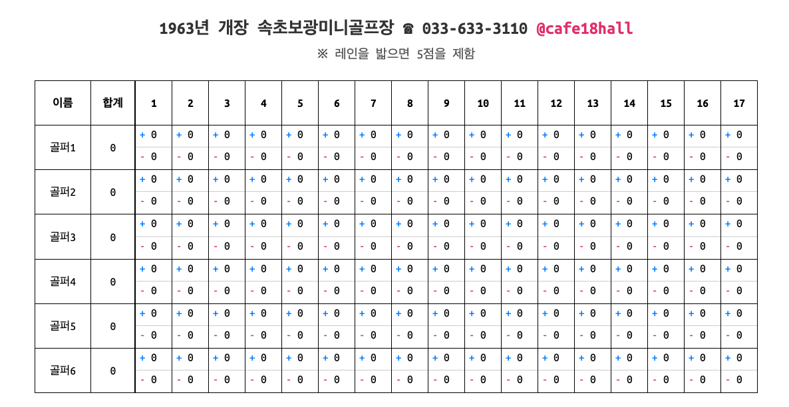

# ⛳ 실시간 미니골프 스코어보드 웹앱

1963년 개장 속초보광미니골프장의 스코어보드를 참고하여 개발된 웹 애플리케이션입니다.
https://cafe18hall.vercel.app

FastAPI와 순수 JavaScript(Vanilla JS)를 사용하여 개발된 직관적인 실시간 미니골프 점수판 웹 애플리케이션입니다.
사용자는 웹 브라우저를 통해 간편하게 미니골프 점수를 기록하고, 모든 플레이어의 점수 현황과 총점을 실시간으로 확인할 수 있습니다.



## ✨ 주요 기능

- **플레이어 관리:**
  - 각 플레이어의 이름을 클릭하여 쉽게 수정할 수 있습니다.
- **실시간 스코어 업데이트:**
  - 각 홀마다 `+` / `-` 점수를 클릭하여 점수를 즉시 변경할 수 있습니다.
  - 점수 변경 시, 페이지 새로고침 없이 해당 플레이어의 총합 점수가 즉시 자동 계산되어 반영됩니다.
- **직관적인 사용자 인터페이스 (UI):**
  - 실제 미니골프 스코어카드와 유사한 그리드 형태의 디자인으로 사용자가 쉽게 적응할 수 있습니다.
  - 1홀부터 17홀까지의 스코어를 한눈에 파악할 수 있습니다.
- **반응형 디자인:**
  - 데스크톱과 모바일 환경 모두에서 최적화된 화면을 제공하여 어떤 기기에서도 편리하게 사용할 수 있습니다.

## 🚀 시작하기

이 프로젝트를 로컬 환경에서 실행하려면 다음 단계를 따르세요.

### 📋 전제 조건

- Python 3.9+
- `pip` (Python 패키지 관리자)

### ⚙️ 설치

1.  저장소를 클론합니다:
    ```bash
    git clone https://github.com/your-username/minigolf.git
    cd minigolf
    ```
2.  필요한 패키지를 설치합니다:
    ```bash
    pip install -r requirements.txt
    ```

### ▶️ 실행

애플리케이션을 시작합니다:

```bash
uvicorn main:app --reload
```

브라우저에서 `http://127.0.0.1:8000`으로 접속하여 스코어보드를 확인하세요.

## 🛠️ 기술 스택

- **Backend:** FastAPI (Python 3.9+)
- **Frontend:** HTML, CSS, Vanilla JavaScript
- **Template Engine:** Jinja2

## 🏛️ 시스템 아키텍처

- **초기 화면 렌더링 (GET `/`):**
  사용자가 웹페이지에 접속하면, FastAPI는 Jinja2 템플릿을 사용하여 기본 스코어보드 UI가 포함된 HTML을 렌더링하여 반환합니다.
- **점수 업데이트 (POST `/score/update`):**
  사용자가 점수 변경 버튼(`+` 또는 `-`)을 클릭하면, 프론트엔드 JavaScript가 `fetch` API를 사용하여 백엔드로 비동기 요청을 보냅니다. FastAPI는 이 요청을 받아 서버 측의 점수 데이터를 업데이트하고, 변경된 점수와 새로 계산된 총점을 JSON 형태로 응답합니다.
- **실시간 UI 반영:**
  프론트엔드는 백엔드로부터 받은 응답 데이터를 사용하여, 페이지 새로고침 없이 점수판의 숫자와 총합을 동적으로 변경합니다.

## 📁 파일 구조 및 설명

이 프로젝트의 주요 파일 및 디렉토리는 다음과 같습니다:

- `.gitignore`: Git이 버전 관리에서 무시할 파일 및 디렉토리를 지정합니다. (예: 컴파일된 Python 파일, 가상 환경 폴더)
- `GEMINI.md`: Gemini CLI 에이전트의 구성 설정을 포함하며, 프로젝트 내에서 에이전트의 동작 및 컨텍스트를 정의합니다.
- `README.md`: 프로젝트에 대한 포괄적인 개요를 제공하는 문서 파일입니다. 프로젝트의 목적, 기능, 설정 지침, 사용 가이드, 기술 스택, 시스템 아키텍처 및 기여 가이드가 포함됩니다.
- `requirements.txt`: 프로젝트 실행에 필요한 모든 Python 패키지 및 해당 버전을 나열합니다. 종속성 관리에 사용됩니다.
- `vercel.json`: Vercel 배포를 위한 구성 파일로, Vercel 플랫폼에 배포될 때 프로젝트가 빌드되고 라우팅되는 방식을 지정합니다.
- `main.py`: 백엔드 애플리케이션의 핵심 파일입니다. FastAPI를 사용하여 라우팅을 처리하고, HTML 템플릿을 제공하며, 점수 업데이트를 처리합니다.
- `static/`: 웹 애플리케이션의 정적 자산(CSS, JavaScript, 이미지 등)을 제공하는 디렉토리입니다.
  - `css/`: CSS 스타일시트를 포함합니다.
    - `style.css`: 웹 애플리케이션의 시각적 모양과 레이아웃을 정의하는 주 스타일시트입니다.
  - `js/`: JavaScript 파일을 포함합니다.
    - `script.js`: 클라이언트 측 상호 작용, 동적 업데이트 및 스코어보드 이벤트 처리를 담당하는 주 JavaScript 파일입니다.
  - `images/`: (추가된 경우) 이미지 파일을 저장하는 디렉토리입니다.
- `templates/`: 백엔드(FastAPI 및 Jinja2)에서 렌더링하는 HTML 템플릿 파일을 저장하는 디렉토리입니다.
  - `index.html`: 미니골프 스코어보드 사용자 인터페이스의 주 HTML 템플릿입니다.

## 🤝 기여하기

기여를 환영합니다! 버그 보고, 기능 제안 또는 코드 개선에 참여하고 싶으시다면 언제든지 이슈를 열거나 풀 리퀘스트를 제출해주세요.

## 📄 라이선스

이 프로젝트는 MIT 라이선스에 따라 배포됩니다. 자세한 내용은 `LICENSE` 파일을 참조하세요.
